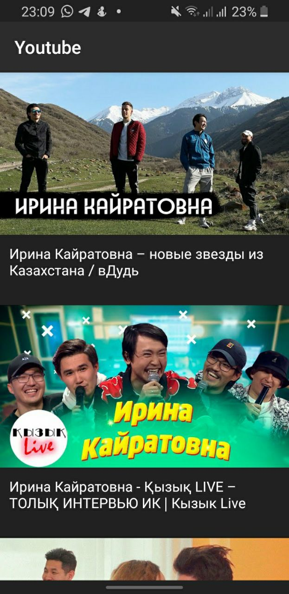
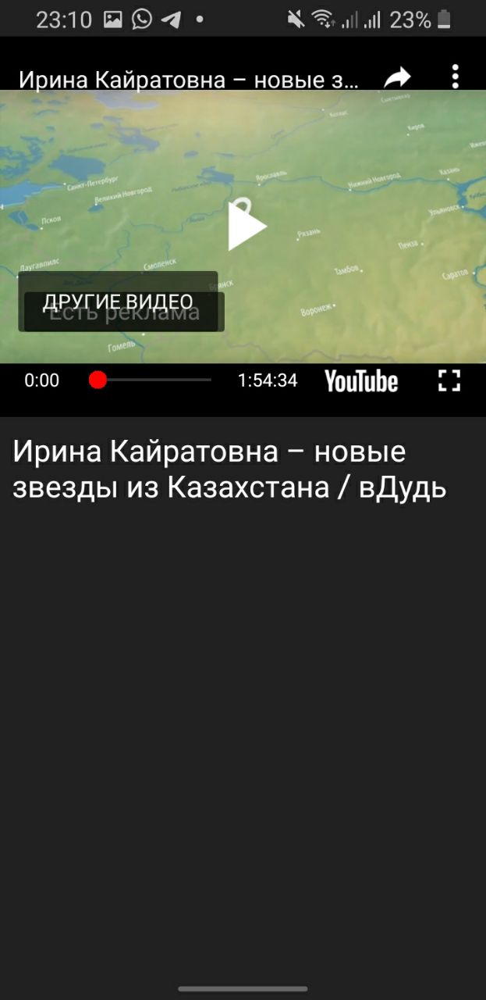
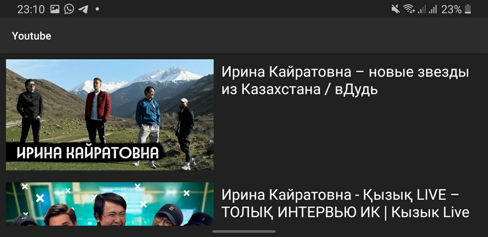
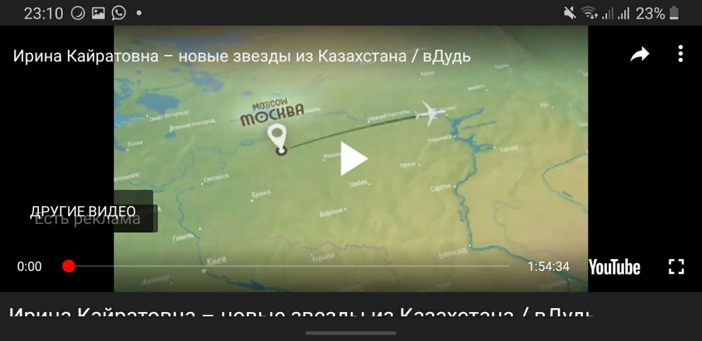

## Приложение
1. Показывает список видео трендов
2. При нажатии на видео открывается фрагмент с видео
3. Использована Retrofit2 c MVP архитектура

## Библиотеки
1. YouTube Android Player API
2. Retrofit2
3. Gson

## Результаты

# dip_max
